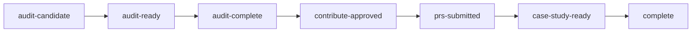

# How it works

The audit pipeline is a labelled-issue state machine with a human approval gate between every
automated stage. Nothing advances on its own judgement alone.

**Discover** trawls public repositories for natural-language artifact sets that meet a size and
freshness bar, and files each candidate as an issue. **Audit** runs a security pre-scan, then scores
every artifact and writes a report plus a machine-readable findings sidecar. **Contribute** submits
fixes — but only for findings someone reproduced, and only within strict caps. **Track** records
what happened to each pull request, and **case study** writes up the ones worth writing up.

## The gates that constrain contribution

The pipeline contacts other people's repositories, so its limits are part of its design rather than
a configuration detail:

- at most three pull requests on first contact with a repository, five thereafter
- at most two distinct repositories contacted per week
- a maintainer's "no" blocks further automated pull requests to that repository
- a finding already addressed by an open pull request is dropped
- repositories requiring a contributor licence agreement, or declining external contributions, are
  skipped with the reason logged
- critical and high security findings take a private disclosure path and never a public pull request

Every submitted fix traces back to a scored finding by fingerprint, so a maintainer can ask where a
change came from and get a specific answer.
